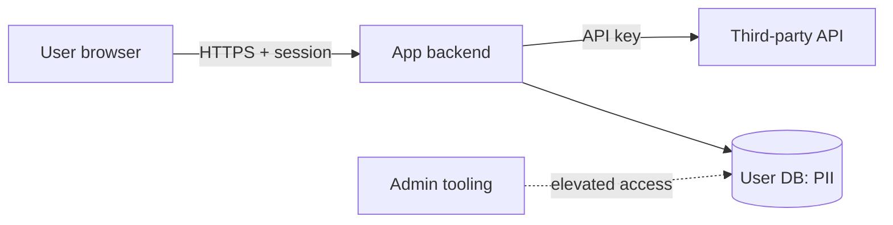

# Threat Modeling

## Purpose
Make the team ask "how would this be attacked?" while the design is still cheap to change. Code-time security is covered by the harness built-in (`/security-review` reviews diffs); this skill covers **design-time** security — a structured "what could go wrong" pass on the tech spec, so mitigations become requirements before Sign-Off 2 instead of findings in code review. It is not a pentest and not a compliance audit: it is an hour (or fifteen minutes) of deliberate attacker thinking, scaled to the attack surface of the change.

## Outputs
**Artifact:** Threat model
**Format:** markdown — system sketch with trust boundaries (mermaid encouraged), prioritized threat table with mitigations, abuse-case list
**Location:** `docs/specs/<feature>-threat-model.md` in the target repo
**Audience:** Eng lead + reviewers at Sign-Off 2

Every mitigation must land in one of three homes: a requirement in the spec ([`../tech-spec/SKILL.md`](../tech-spec/SKILL.md)), an [`../adr/SKILL.md`](../adr/SKILL.md) recording an accepted risk, or an explicitly accepted risk with a named owner. A mitigation that lives only in the threat doc doesn't exist.

## Prerequisites
- A storming/norming design to model against — the tech spec ([`../tech-spec/SKILL.md`](../tech-spec/SKILL.md)) or, failing that, the PRD ([`../prd-development/SKILL.md`](../prd-development/SKILL.md)). You cannot threat-model an idea; you need components and data flows.

## Workflow

### Step 1: Scope check — right-size first

Decide how much modeling this change deserves. Over-modeling is the fastest way to kill the practice.

| Change | Pass |
|---|---|
| New attack surface: new endpoint, new data class (esp. PII), new third-party integration, authn/authz change, new trust boundary | **Full pass** (Steps 2–6) |
| Everything else touching data or logic | **Short pass** — 15 minutes on the Threat Modeling Manifesto's four questions: *What are we building? What can go wrong? What are we going to do about it? Did we do a good job?* Write the answers down; that's the artifact. |
| Pure UI polish, no data or authz change | **Skip** — and say so explicitly in the spec's security section ("threat model: skipped, no new attack surface"). A recorded skip is a decision; a silent skip is a gap. |

### Step 2: Sketch the system

Draw what you're building as an attacker would see it:

- **Components** — services, clients, stores, queues, third parties
- **Data flows** — what moves where, over what channel
- **Trust boundaries** — every point where the level of trust changes (user↔app, app↔backend, backend↔third-party, service↔service, human↔admin-tooling). These are where threats live. For a spotting guide, read `references/stride-checklist.md`.
- **Assets** — what's worth stealing or breaking: credentials, PII, money-moving operations, availability of the thing itself

A mermaid data-flow sketch is encouraged — boxes for components, arrows for flows, dashed lines for trust boundaries:

### Step 3: Enumerate threats per boundary with STRIDE

Walk each trust boundary and ask what each STRIDE category looks like there:

- **S**poofing — pretending to be someone/something else
- **T**ampering — modifying data or code in flight or at rest
- **R**epudiation — doing something and denying it, unprovably
- **I**nformation disclosure — data reaching eyes it shouldn't
- **D**enial of service — making the thing unavailable
- **E**levation of privilege — doing what you're not authorized to do

For per-category prompt questions with concrete web/mobile/API examples, read `references/stride-checklist.md`. Not every category applies at every boundary — record "considered, not applicable" rather than skipping silently.

### Step 4: Write abuse cases

Rewrite the feature's top user stories as attacker stories:

> "As a **logged-out user**, I can **enumerate profile IDs** by walking the sequential `/users/{id}` endpoint, so that I harvest emails for phishing."

> "As a **rate-limit-free API client**, I can **replay the coupon-redeem call**, so that I redeem one code many times."

The form forces specificity: an actor, an action the design currently permits, and a payoff. Three to seven good abuse cases beat an exhaustive enumeration.

### Step 5: Prioritize and route mitigations

Score each threat **impact × exploitability** on a simple H/M/L matrix — no CVSS theater:

| | Easy to exploit | Moderate | Hard |
|---|---|---|---|
| **High impact** | High | High | Medium |
| **Medium impact** | High | Medium | Low |
| **Low impact** | Medium | Low | Low |

Then route:
- **Every High gets a mitigation in the spec** — added to [`../tech-spec/SKILL.md`](../tech-spec/SKILL.md)'s design as a requirement — **or** an [`../adr/SKILL.md`](../adr/SKILL.md) recording the accepted risk with rationale and an owner.
- Mediums get a mitigation, a backlog item, or an accepted-risk line with an owner.
- Lows are recorded and accepted unless the mitigation is free.
- PII / data-classification findings additionally feed the privacy row of `release-readiness` — they're gate evidence.

### Step 6: Set the revisit trigger

The model is updated **when the attack surface changes** — new endpoint, new data class, new integration, authz change — not on a calendar. Write the trigger into the doc ("revisit when: X"). A threat model reviewed annually but never on change is decoration.

## Pitfalls

- **Threat-modeling theater:** the doc exists but no design decision changed because of it → the exercise cost time and bought nothing, and the team learns it's a checkbox → every High threat must trace to a spec requirement, an ADR, or a named risk owner; if the pass produced zero changes and zero accepted risks, say why or admit the scope check should have said "skip".
- **Modeling everything at max depth:** every ticket gets a full STRIDE pass → the team burns out and quietly stops doing it at all → right-size in Step 1; the 15-minute four-questions pass is a legitimate, complete outcome for most changes.
- **Mitigations that live only in the threat doc:** the model lists fixes but the spec and backlog never heard of them → implementers build the unmitigated design; the threat doc becomes a record of known-and-ignored risks → Step 5's routing is mandatory: spec requirement, ADR, or owned accepted risk — no fourth bucket.
- **Confusing it with code review:** "/security-review will catch it" → diff review catches implementation flaws (injection, secrets in code), not design flaws (missing authz model, trust-boundary-free architecture) — by code review the design is already built → this pass happens at design time; the two layers are complements, not substitutes.
- **Solo modeling:** one person fills in the template alone → attacker creativity scales with brains in the room; a solo pass finds the threats its author already knew about → do Steps 3–4 with at least two people (eng + one outsider — PM, another team's engineer, anyone who'll ask naive questions).

## Next steps
- [`../tech-spec/SKILL.md`](../tech-spec/SKILL.md) — fold mitigations into the design as requirements; the spec's Security & privacy section links back here
- [`../adr/SKILL.md`](../adr/SKILL.md) — record each accepted risk as a decision with rationale and owner
- `release-readiness` — PII/data-class findings become the security gate's evidence at ship time
