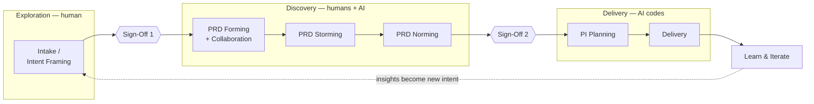

# BLUEPRINT — Make Building Products Fun Again

The canonical map from the org's product blueprint to this skills portfolio.
The blueprint's philosophy: **humans dictate direction; AI executes.**
Exploration is human ("frame the problem before touching AI"); Discovery is
AI-first ("humans and AI work the codebase together — humans bring taste, AI
explores the space"); Delivery is AI-first ("AI codes; humans consult, review,
ship"). Each column is a **milestone** — skipping a step doesn't save time, it
just pushes the rework later.

This file is a map, not an essay: find your column, take its skill, produce
its output, clear the gate.

## The flow

## Master table — column → outputs → skills

| Column / stage | Phase dir | Blueprint output | Skill(s) |
|---|---|---|---|
| Intake / Intent Framing | `1-exploration/` | Product Brief | `product-brief` |
| | | Prioritization | `prioritization-advisor` |
| **Sign-Off 1** | — | gate (see below) | — |
| PRD Forming + Collaboration | `2-discovery/` | Kickoff / Workshop | `workshop-facilitation` |
| | | Problem exploration + assumptions + risks | `problem-statement`, `problem-framing-canvas`, `opportunity-solution-tree`, `jobs-to-be-done` |
| | | PRD — Forming | `prd-development` |
| PRD Storming | `2-discovery/` | Conceptual flows + UX risks | `design-signal` (30%) |
| | | Eng Feasibility / POC | `eng-feasibility-spike` |
| | | PRD — Storming | `prd-development` |
| PRD Norming | `2-discovery/` | Testable UX + usability insights | `design-signal` (60%) |
| | | PRD — Norming | `prd-development` |
| | | Architecture Change Record (ACR) | `adr` (+ `tech-spec`, `api-design`) |
| **Sign-Off 2** | — | gate (see below) | — |
| PI Planning | `3-delivery/` | MVP scope + sequencing | `pi-planning` |
| | | Dev Ready Design | `design-signal` (90%) |
| | | Dev Ready Architecture | `tech-spec` (+ settled `adr`s, `api-design`) |
| | | PRD — Commitment-Ready | `pi-planning` |
| | | Epics / Tickets | `pi-planning` (+ `user-story`, `user-story-splitting`, `epic-breakdown-advisor`) |
| Delivery | `3-delivery/` | Build / test / release | framework packs (`cleanui`, Tailwind, Expo, NestJS, `ralph`, `agent-docs`) + `test-strategy` + `release-readiness` |
| | | PRD — Live | `release-readiness` |
| Learn & Iterate | `4-iteration/` | Insights + adjustments | `learn-iterate` (+ metrics skills, `incident-postmortem`) |
| | | PRD — Updated (Iteration) | `learn-iterate` |

PRD stage names (Forming → Storming → Norming → Commitment-Ready → Live →
Updated) describe the *maturity of one document* owned by `prd-development`;
the other skills in each row feed it.

## Lanes

| Lane | Accountable for | Core skills |
|---|---|---|
| **Product** | Problem framing, prioritization, PRD readiness | `product-brief`, `prioritization-advisor`, `problem-statement`, `problem-framing-canvas`, `opportunity-solution-tree`, `jobs-to-be-done`, `prd-development`, `pi-planning`, `learn-iterate` |
| **Design** | Experience confidence, usability risk closure — Discovery → Design Signal 30% → 60% → 90% | `design-signal`, `customer-journey-map`, `customer-journey-mapping-workshop`, `proto-persona`, `storyboard`, `lean-ux-canvas` |
| **Eng Lead** | Feasibility, architectural impact — Consult → Investigation/spike → Architecture Change Record → Consult | `eng-feasibility-spike`, `adr`, `tech-spec`, `api-design` |
| **Engineering** | Delivery execution | `test-strategy`, `release-readiness`, `agent-docs`, framework packs (`cleanui`, Tailwind, Expo, NestJS), `ralph` |

## Sign-off gates

### Sign-Off 1 — end of Intake / Intent Framing

**Requires:** a Product Brief (`product-brief`) and a prioritization call
(`prioritization-advisor`) — the problem is framed, sized, and worth a
discovery investment.

**Stakeholders provide:** intent, constraints, success criteria.
**Stakeholders do NOT weigh in on:** solutions — none exist yet, by design.

### Sign-Off 2 — end of PRD Norming

**Requires:** a normed PRD (`prd-development`), design signal at 60%
(`design-signal`), feasibility proven or killed (`eng-feasibility-spike`),
and architecture impact recorded (`adr`).

**Stakeholders validate:** business rules (at Norming) — **not the user
journey**; that is the Design lane's accountability, closed via usability
evidence.

**At PI Planning (post-gate), stakeholders validate:** scope, sequencing,
outcomes — **not solution details**; those are owned by the team.

Stakeholder touchpoints across the flow: intake (intent, constraints, success
criteria) → PRD Forming (consulted on problem alignment) → PRD Norming
(consulted on business-rule validation) → PI Planning (validate scope,
sequencing, outcomes).

## Where AI lives

| Phase | Mode | What that means |
|---|---|---|
| Exploration | **Human** | Frame the problem before touching AI. Skills here structure human thinking; AI drafts, humans decide what matters. |
| Discovery | **Humans + AI** | Humans and AI work the codebase together. Humans bring taste; AI explores the space — feasibility spikes, option enumeration, PRD drafting. |
| Delivery | **AI-first** | AI codes. Humans consult, review, ship. Framework packs and `ralph` drive execution; `test-strategy` and `release-readiness` are the human review levers. |
| Learn & Iterate | **Humans + AI** | AI aggregates signals (`learn-iterate`, metrics skills); humans decide what the next loop's intent is. |

## The loop

Learn & Iterate feeds back into Intake: insights become new intent, the PRD is
updated (never abandoned), and the next pass re-enters the flow at whatever
column the size of the change warrants — a business-rule tweak may re-enter at
Norming; a new problem starts at Intake. Use each column as a milestone;
skipping a step doesn't save time — it just pushes the rework later.

---

For this map driven once end to end — one feature, every stage, every gate,
including the conditional paths — see [WALKTHROUGH.md](WALKTHROUGH.md).
