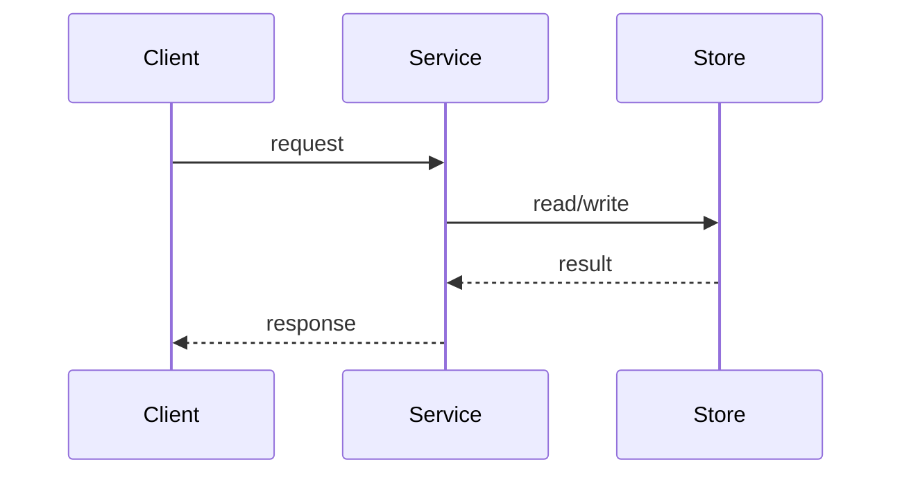

# Tech Spec

## Purpose
Bridge the gap between an approved PRD ("what and why") and code ("how"). A tech spec forces the engineering design work — options weighed, trade-offs made explicit, data and API impact mapped, rollout planned — to happen **before** implementation, where changing your mind costs a conversation instead of a rewrite. The output is a reviewable document that lets engineers align on the design, reviewers challenge it cheaply, and future readers understand why the system looks the way it does.

## Outputs
**Artifact:** Tech spec (engineering design doc / RFC)
**Format:** markdown, with mermaid diagrams where a diagram clarifies the design
**Location:** `docs/specs/<feature-slug>.md` in the target repo
**Audience:** Engineers implementing the work + engineers reviewing the design

## Prerequisites
- An approved PRD or problem statement — see `prd-development`. The spec links to it and must not restate it.
- If no PRD exists, gather the same inputs inline before designing: the problem, who has it, success criteria, and explicit out-of-scope items. Do not skip this — a spec without an agreed problem is a solution looking for one.

## Workflow

### Step 1: Confirm the input and right-size

Read the PRD (or gather the problem inline). Then decide how much spec this work deserves — see [Right-sizing](#right-sizing) below. Three outcomes:

1. **Full spec** — new system, cross-team surface, migration, or hard-to-reverse choices
2. **One-pager** — bounded feature inside an existing design
3. **No spec** — write the code (record any lasting decision as an ADR via [`../adr/SKILL.md`](../adr/SKILL.md))

If the outcome is "no spec", stop here and say so. Writing an unneeded spec is its own failure mode.

### Step 2: Extract goals, non-goals, constraints

From the PRD and the codebase, before considering any solution:

- **Goals** — the 3-7 outcomes the design must achieve, phrased so a reviewer can check the chosen design against each one. Derive from the PRD's success metrics, not from implementation ideas.
- **Non-goals** — things a reasonable reader might expect this design to cover that it deliberately does not. These prevent scope creep during review ("shouldn't this also handle X?" → "non-goal, see §2").
- **Constraints & assumptions** — the fixed points: existing architecture and stack, performance/scale targets, compliance requirements, deadlines, team skills. Separate hard constraints (violating them fails the design) from assumptions (plausible but unverified — each assumption is a risk; note how it could be checked).

### Step 3: Generate real options (minimum 2)

This is the step that distinguishes a spec from a justification memo. Produce **at least two options that a competent engineer might genuinely choose** — not one real option plus a strawman.

For each option capture:
- One-paragraph sketch of the approach
- Trade-offs against the goals and constraints (a table works well: option × {complexity, performance, migration cost, operational burden, reversibility})
- What would make you pick it / reject it

Cheap sources of a genuine second option: buy vs build, extend-existing vs new component, sync vs async, do-less (cut a requirement and simplify), and do-nothing (the baseline every option must beat). If you cannot articulate a second option, you have not explored the design space — go look at how adjacent systems solved this.

### Step 4: Choose and detail the design

Pick an option and say **why**, referencing the trade-off analysis. Then detail it to the level the implementers need:

- Component responsibilities and how they interact — add a mermaid diagram when the design has 3+ moving parts or a non-obvious flow (sequence diagram for request flows, flowchart for state/decision logic). Skip the diagram when prose is clearer; a diagram that restates one sentence is noise.
- Key interfaces and boundaries — what each part owns, what crosses each boundary
- Failure modes — what happens when each dependency is slow, down, or returns garbage

Detail stops where the implementers' judgment starts: specify contracts and invariants, not variable names.

### Step 5: Map data & API impact

Enumerate every externally observable change:

- **Schemas** — new/changed tables, indexes, retention; migration plan and its rollback
- **API contracts** — new/changed endpoints, request/response shapes, versioning and backward compatibility for existing consumers; route contract-level review through [`../api-design/SKILL.md`](../api-design/SKILL.md)
- **Events/messages** — new topics, payload changes, consumer impact

If this section is genuinely empty, say "No data or API impact" explicitly — an absent section reads as "not considered".

### Step 6: Security & privacy pass

Walk the design once with an attacker's eyes and once with a regulator's:

- New attack surface (endpoints, inputs, file handling, deserialization)
- AuthN/authZ — who can invoke each new capability, and how that is enforced
- Data classification — does the design touch PII/PHI/secrets? Where is it stored, logged, transmitted? Retention and deletion?
- Secrets and credentials — how are they injected, scoped, rotated?

One honest paragraph beats a compliance checklist. If the answer is "no new surface, no sensitive data", write that.

### Step 7: Plan verification and rollout

- **Test approach** — what proves each goal is met: unit/integration/E2E split, what gets faked vs hit for real, load or failure testing if the constraints demand it. Route the full plan through `test-strategy`; the spec carries the summary and the link.
- **Rollout** — how the change reaches production: feature flag, percentage rollout, migration sequencing, monitoring that would reveal trouble early.
- **Rollback** — the step-by-step path back if it goes wrong, written **before** shipping. If a step is irreversible (destructive migration, external announcement), flag it and state the mitigation. Gate the ship decision through `release-readiness`.

### Step 8: Log decisions and bound the open questions

- **Decision log** — every significant decision made while writing the spec, with a one-line rationale. Decisions that will outlive this spec (a datastore choice, a protocol, a build-vs-buy) get promoted to a standalone ADR via [`../adr/SKILL.md`](../adr/SKILL.md) and linked; the rest stay inline.
- **Open questions** — each entry needs an **owner and a resolution deadline or triggering milestone**. An open question that blocks implementation must be resolved before the spec is approved; one that doesn't should say which part of the work it gates. Cap the list — more than ~5 open questions means the design isn't ready for review, it's a research task.

### Step 9: Review

Circulate to the implementing engineers and at least one engineer outside the feature team. The review question is not "do you like it?" but "which goal does this design fail, and which option handles it better?" Update the spec with the outcome; once approved, the spec is the reference for implementation — keep it updated when reality diverges (a stale spec is worse than none).

## The spec template

Produce the document in this shape. Sections may be short, but each must be present (or explicitly marked not-applicable) in a full spec.

````markdown
# <Feature name> — Tech Spec

**Status:** draft | in review | approved | superseded
**Author(s):** … · **Reviewers:** … · **Last updated:** YYYY-MM-DD
**PRD:** <link to the approved PRD or problem statement>

## 1. Context & problem
Two paragraphs max: the problem, and why it needs an engineering design
now. Link to the PRD for the full "what/why" — do not restate it.

## 2. Goals / non-goals
**Goals:** checkable outcomes the design must achieve.
**Non-goals:** adjacent things this design deliberately does not do.

## 3. Constraints & assumptions
Hard constraints (stack, scale, compliance, deadline) vs assumptions
(unverified — note how each could be checked).

## 4. Options considered
Minimum 2 genuine options. For each: sketch, trade-offs vs the goals,
why it wins or loses. Include the do-nothing baseline where meaningful.

| Option | Complexity | Perf | Migration | Reversibility | Verdict |
|---|---|---|---|---|---|

## 5. Chosen design
The selected option, the reason (referencing §4), and the detail
implementers need: components, interactions, boundaries, failure modes.



## 6. Data & API impact
Schemas, migrations (+ rollback), API contracts and versioning, events.
Contract review: ../api-design. If none: "No data or API impact."

## 7. Security & privacy considerations
New attack surface, authN/authZ, sensitive data handling, secrets.

## 8. Test approach
What proves each goal; unit/integration/E2E split. Full plan:
`test-strategy`.

## 9. Rollout & rollback plan
Flagging/sequencing, monitoring, and the step-by-step path back.
Irreversible steps flagged. Ship gate: `release-readiness`.

## 10. Open questions
| # | Question | Owner | Resolve by | Blocks |
|---|---|---|---|---|

## 11. Decision log
| Date | Decision | Rationale | ADR |
|---|---|---|---|
````

## Right-sizing

Match the document to the blast radius of being wrong:

| Signal | Full spec (all 11 sections) | One-pager | No spec |
|---|---|---|---|
| Scope | New system/service, cross-team surface | Feature within an existing design | Bug fix, refactor, config change |
| Reversibility | Migrations, protocol/datastore choices | Reversible in one release | Trivially reversible |
| Who must align | Multiple engineers/teams | 1-2 engineers | The author |
| Design uncertainty | Real competing options exist | Approach is obvious, details aren't | No design decisions |

**One-pager variant:** collapse to Context & problem, Goals/non-goals, Chosen design (with one alternative dismissed in a sentence — the discipline of naming an alternative stays), Data & API impact, Test + rollout in one paragraph, Open questions. Still lives at `docs/specs/<feature-slug>.md`.

**When NOT to write one:**
- The PRD plus existing architecture already fully determine the implementation — there is no design decision to make.
- The work is exploratory (spike/prototype) — write the spec *after* the spike, informed by what you learned, and before the production build.
- The only lasting output is a single decision — record it directly as an ADR ([`../adr/SKILL.md`](../adr/SKILL.md)) instead of wrapping it in spec ceremony.
- You are writing it to document code that already shipped — see the spec-as-afterthought pitfall below.

## Review checklist

The approval gate. A reviewer (or the author, before circulating) should be able to answer yes to each:

- [ ] Every goal in §2 is checkable, and the chosen design addresses each one
- [ ] §4 contains at least two options a competent engineer might genuinely pick, and the do-nothing baseline is priced in where meaningful
- [ ] The choice in §5 is justified against §4's trade-offs, not by author preference
- [ ] Every schema/API change in §6 has a migration path *and* a rollback; existing consumers are accounted for
- [ ] §7 names the sensitive data the design touches — or states there is none
- [ ] §9's rollback is step-by-step, and every irreversible step is flagged
- [ ] Every §10 open question has an owner and a resolve-by; none of the remaining ones block implementation
- [ ] Decisions that outlive the spec are promoted to ADRs, not buried in §11

## Example: what "real options" look like

Excerpt from a spec for adding full-text search to a document store (PRD: users can't find their documents; success metric: search-to-open rate).

```markdown
## 4. Options considered

### Option A: Postgres full-text search (tsvector on existing DB)
Extend the current `documents` table with a generated tsvector column
and a GIN index. Query through the existing repository layer.
- + No new infrastructure; one migration; transactionally consistent
- + Reversible: drop the column and index
- − Relevance ranking is basic; no typo tolerance
- − Couples search load to the primary DB (constraint: p95 < 200ms
    holds only up to ~5M docs per our load test of a comparable query)

### Option B: Dedicated search engine (OpenSearch)
Index documents into a managed OpenSearch cluster via an outbox +
indexer worker; search bypasses the primary DB.
- + Typo tolerance, ranking, faceting; headroom past 100M docs
- − New infrastructure to run, monitor, and secure
- − Eventual consistency: a saved doc may be unsearchable for seconds
- − Two sources of truth; reindex tooling needed for schema changes

### Option C: Do nothing (baseline)
Keep the current LIKE-based filter.
- − Fails the PRD's success metric today at current corpus size (§1)

| Option | Complexity | Perf @10M docs | Migration | Reversibility | Verdict |
|---|---|---|---|---|---|
| A: Postgres FTS | Low | Marginal | 1 migration | High | chosen |
| B: OpenSearch | High | Strong | Backfill + dual-write | Medium | revisit at ~5M docs |
| C: Do nothing | None | Failing | None | — | rejected |

**Choice:** A — we are at 800K docs; B's operational cost buys headroom
we won't need for ~2 years. Decision "revisit search engine at 5M docs"
promoted to ADR-014 with the trigger metric attached.
```

Note what makes this reviewable: both A and B are designs a competent engineer might pick, the trade-offs reference the goals and constraints (p95 target, corpus size), the baseline is priced in, and the growth condition that would flip the decision is recorded where someone will find it.

## Pitfalls

### Pitfall 1: Solution-first spec
**Symptom:** §4 has one real option plus a strawman, or the "options" differ only in trivia — the author decided first and documented backwards

**Consequence:** Review can only rubber-stamp; the first design survives by default and its weaknesses surface in production instead of in review

**Fix:** Generate options in Step 3 *before* detailing any design. Require each option to be one a competent engineer might actually pick — buy vs build, extend vs new, sync vs async, do-less, do-nothing

---

### Pitfall 2: Spec restates the PRD
**Symptom:** Pages of problem framing, personas, and success metrics copied from the PRD; the actual design is one thin section at the end

**Consequence:** Two documents own the same facts and drift apart; reviewers wade through what they already approved and skim past the part that needed their scrutiny

**Fix:** §1 is two paragraphs plus a link; every reused fact is a link to the PRD, never a copy. If you find yourself arguing about the *what*, the PRD is not actually approved — go back to `prd-development`

---

### Pitfall 3: Unbounded open-questions list
**Symptom:** §10 grows past ~5 entries, none with owners or dates; the same questions carry over review after review

**Consequence:** The spec gets approved with the hard problems unresolved, and implementers make the deferred decisions ad hoc under deadline pressure — the decisions the spec existed to make deliberately

**Fix:** Every open question gets an owner and a resolve-by date or milestone; questions that block implementation are resolved before approval. If the list won't shrink, the design needs a research spike, not another review round

---

### Pitfall 4: Spec-as-afterthought
**Symptom:** The spec is written (or backfilled) after the implementation is largely done, to satisfy process

**Consequence:** The options analysis is fiction, review is theater, and the one thing a spec buys — changing the design while it's cheap — was already forfeited

**Fix:** The spec precedes implementation. If code already exists, don't fake a spec: record the significant decisions honestly as ADRs ([`../adr/SKILL.md`](../adr/SKILL.md)) and write a real spec for the *next* change

---

### Pitfall 5: Diagram decoration
**Symptom:** A mermaid diagram restating a one-sentence flow, or an architecture picture full of boxes no section of the spec explains

**Consequence:** Readers study the diagram for meaning that isn't there, and the diagram silently rots as the design evolves

**Fix:** Add a diagram only where structure beats prose — 3+ components or non-obvious sequencing — and make every box and arrow correspond to something §5 names

---

### Pitfall 6: Detail past the boundary
**Symptom:** The spec prescribes class names, file layout, function signatures, or pixel-level behavior

**Consequence:** The document rots against the codebase within weeks; implementers learn to ignore it, and with it the parts that mattered

**Fix:** Specify contracts, invariants, and failure modes. Anything an implementer could reasonably decide either way belongs to the implementer

## Next steps
- [`../adr/SKILL.md`](../adr/SKILL.md) — promote each decision that outlives this spec (datastore, protocol, build-vs-buy) to a standalone ADR
- `test-strategy` — expand §8 into the full test plan before implementation starts
- `release-readiness` — run before shipping; §9 of the spec is its input
